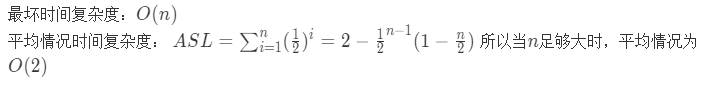

**王欢** **学号：220181499**
**github:** https://github.com/njustwh2014/data_structure_example

# 分析算法时间复杂度
下面的算法 完成对一个n位 位 二进制数做加1的操作。假如无溢出 ，该算法在最坏情况下的时间复杂度为$O(n)$，试问平均情况下的时间复杂度是什么？请用数学推导或实验验证的方式证明你的结论。
```python
def Inc(A):
    i=len(A)-1
    while A[i]==1:
        A[i]=0;i-=1;count+=1
    count+=1
    A[i]=1
```
最坏时间复杂度：$O(n)$
平均情况时间复杂度： $ASL=\sum_{i=1}^{n}(\frac{1}{2})^i=2-\frac{1}{2}^{n-1}(1-\frac{n}{2})$ 所以当$n$足够大时，平均情况为$O(2)$



#### 2.现有互不相同的n个整数,试编写算法,输出从这n个数中取出k个数的 所有可重复排列(0<k<=n)。例如：若n个数是1,2,3,k=2,则输出结果为:11,12,13,21,22,23,31,32,33.

**代码实现：**
```python
k=3
a=[1,2,3,4,5]
v=[None]*k
m=0
def arrangement(a,k,v,m):
    ret=[];
    if(k==1):
        for i in range(len(a)):
            if(v[len(v)-1]!=None):
                v[k-1]=a[i]
                c="";
                for j in range(0,len(v)):
                    c=c+str(v[j]);
                ret.append(c);
        return ret;
    else:
        for i in range(m,k):
            for j in range(0,len(a)):
                v[i]=a[j];
                ret=ret+arrangement(a,k-1,v,m+1);
        return ret;
```
算法时间复杂度: $O(n^2)$

#### 3.在由整型数组成的序列A={a0,a1,…,an-1}中称ai-aj（0<=i<j<n）为数对ai和aj之差。考虑下面的算法，它求的是序列中数对之差的最大值。

```python
def MaxDiff( A ) : # 平方时间复杂度
    n = len(A)
    dmax = 0
    for i in range(n) :
        for j in range(n):
            if i < j and A[i] - A[j] > dmax :
                dmax = A[i] - A[j]
    return dmax
```
**改进成线性时间复杂度算法实现**
```python
def MaxDiff (a):
    max_temp=a[0];
    max_temp_index=0;
    min_temp=a[0];
    dmax=0;
    for i in range(len(a)):
        if(a[i]>max_temp):
            max_temp=a[i];
            max_temp_index=i;
    for i in range(max_temp_index+1):
        if(a[i]<min_temp):
            min_temp=a[i]

    dmax=max_temp-min_temp
    return dmax
```

####  一个（元素可重复）序列中两个元素的最短距离是两个元素所有可能的距离中的最小值。例如：若序列为:{1,4,3,2,6,5,6,7,4,3,2,3,1,5,9,8,6,4,2,5}则2和7的最小距离为3;5和1的最小距离为1。考虑下面的算法，它求的是序列中两个指定元素的最小距离。

```python
def MinD(A, x, y) : #  平方时间复杂度
    n = len(A)
    Min, d1, d2 = 1000, -1, -1
    for i in range(n) :
        for j in range(i, n) :
            if A[i] == x and A[j] == y or A[i] == y and A[j] == x :
                if abs(i-j) < Min :
                Min, d1, d2 = abs(i - j), i, j
    return Min, d1, d2
```

请对该算法进行改进(或重写),使得其能够达到线性的时间复杂度.

```python
def MinD(A,x,y):
    n=len(A);
    x_index=n;
    x_index_temp=n;
    y_index=n;
    y_index_temp=n;
    min_d=n;
    min_temp=n;
    for i in range(n):
        if(A[i]==x):
            x_index_temp=i;
            min_temp = abs(x_index_temp-y_index_temp);
            if(min_temp<min_d):
                min_d=min_temp;
                x_index = x_index_temp
                y_index = y_index_temp;
        if(A[i]==y):
            y_index_temp=i
            min_temp = abs(x_index_temp - y_index_temp);
            if (min_temp < min_d):
                min_d = min_temp;
                x_index=x_index_temp
                y_index = y_index_temp;
    if(x_index==n or y_index==n):
        print("not found x or y!")
        return False
    else:
        return min_d,x_index,y_index
```

####  输入为n个整数组成的序列A ，求A 中其和为最大的子序列的和。例如：
若A 为：{ -2, 11, -4, 13, -5, -2 }
则最大子序列和为20 。
若A 为：{ -6, 2, 4, -7, 5, 3, 2, -1, 6, -9, 10, -2 }
则最大子序列和为16 。
考虑下面的算法，它求的是序列A 中其和为最大的子序列的和。

```python
def MaxSubsequenceSum(A) : # O(n^3) 时间复杂度 度
    n = len(A)
    maxSum = 0
    for i in range(n) :
        for j in range(n) :
            thisSum = 0
            for k in range(i, j) :
                thisSum += A[k]
            if thisSum > maxSum :
                maxSum = thisSum
                return maxSum
```

请对该算法进行改进（或重写），使得其能够达到线性的时间复杂度。

```python
def MaxSubsequenceSum(A):
    dp=[];
    n=len(A);
    dp.append(A[0]);
    max_sum=0;
    for i in range(1,n):
        dp.append(max(A[i],A[i]+dp[i-1]))
    for i in range(n):
        if(dp[i]>max_sum):
            max_sum=dp[i]
return max_sum
```

####  现有 n  个整数组成的序列A ，求A 中其和 为指定数K的所有（连续）子序列。 例如：若A为:{13,7,3,6,6,5,7,6,3,2,9,5,6,4,5}则其和为K = 20  的子序列有：
{ 13, 7 }
{ 3, 6, 6, 5 }
{ 6, 3, 2, 9 }
{ 9, 5, 6 }
{ 5, 6, 4, 5 }
考虑下面的算法，它输出序列A中其和为K的所有子序列。

```python
def EqualK(A, s) : # O(n^3) 时间复杂度 度
    n = len(A)
    Sum = 0
    for i in range(n) :
        for j in range(i, n) :
            Sum = 0
        for k in range(i, j+1) :
            Sum += A[k]
         if Sum == s :
            print A[i : j+1], ': ', s
```

请对该算法进行改进（或重写）,使得其能够达到线性的时间复杂度.

```python
def EqualK(A, s):
    n=len(A);
    temp=[];
    ret=[];
    sum=0;
    for i in range(n):
        sum=sum+A[i];
        # print(sum)
        if(sum>s):
            sum=sum-temp.pop(0)
            temp.append(A[i])
            while(sum>s):
                sum = sum - temp.pop(0)
            if(sum==s):
                print(temp)
                ret.append(temp.copy())
                sum = sum - temp.pop(0)
        elif(sum<s):
            temp.append(A[i])
        else:
            temp.append(A[i])
            print(temp)
            ret.append(temp.copy())
            sum=sum-temp.pop(0)
    return ret
```