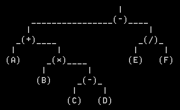
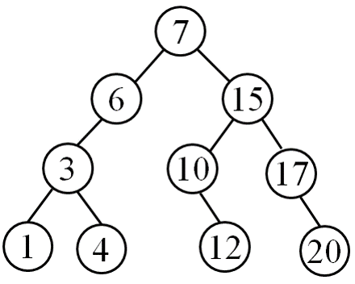

**王欢** **学号：220181499**
**github:** https://github.com/njustwh2014/data_structure_example

# 非线性结构--树

#### 二叉树算法的调试过程中常常需要直观的了解二叉树的构成和形状。试编写算法，在字符界面上输出给定的二叉树.


```python

```

#### 若树中任一结点的左右子树高度之差的绝对值不大于1，则称该树是平衡的。试编写线性时间复杂度的算法，判断给定二叉树是否是平衡的。


#### 若遍历二叉树T的方式是：第一层从左到右，然后第二层从右到左，再然后第三层从左到右，……。试编写算法实现这样的遍历。


遍历结果为：7, 15, 6, 3, 10, 17, 20, 12, 4, 1

#### 二叉树中两结点之间的距离为连接两结点的分支数。定义二叉树的直径为树中任意两个不同结点之间距离的最大值，试编写算法，求任意二叉树的直径。

#### 计算二叉树T的带权路径长度。（带权路径长度定义为各叶结点所带的权值与该结点到根的路径长度的乘积的和）

#### 设a是T中的一个结点，a及a的所有的子孙结点组成的树被称为T的一棵子树，a是这棵子树的根。 试设计算法，找出给定树中其结点值之和为最大的子树的和（T中结点的值可正可负）。

#### 试编写算法，找出二叉搜索树中与指定值k最接近的关键码。


**以上各题代码实现**
```python
from queue import Queue


class Node():
    def __init__(self, data, lchild=None, rchild=None):
        self.data = data;
        self.lchild = lchild;
        self.rchild = rchild;


class BinaryTree():
    def __init__(self):
        self.root=None;

    def is_empty(self):
        return True if self.root==None else False;

    def build_binary_tree(self,data):#按层次建立二叉树，类似leetcode的测试。
        # '#' 表示该节点没有
        # 默认输入数据没问题
        newnode=Node(data[0]);
        node_cur=Queue();

        self.root=newnode;
        node_cur.put(self.root);
        temp_node=Node(0);
        i=1;
        while(i<len(data)):
            cur=node_cur.get();
            if(data[i]!='#'):
                newnode=Node(data[i]);
                cur.lchild=newnode;
                node_cur.put(cur.lchild);
            else:
                if(cur==temp_node):
                    node_cur.put(temp_node);
                else:
                    cur.lchild = None;
                    node_cur.put(temp_node);

            if(not (i+1<len(data))):
                break;
            if(data[i+1]!='#'):
                newnode=Node(data[i+1]);
                cur.rchild = newnode;
                node_cur.put(cur.rchild);
            else:
                if (cur == temp_node):
                    node_cur.put(temp_node);
                else:
                    cur.rchild = None;
                    node_cur.put(temp_node);
            i=i+2;


    def add(self,data):
        newnode=Node(data);
        if(self.is_empty()):
            self.root=newnode;
            return ;
        else:
            temp=[];
            temp.append(self.root);
            while True:
                cur = temp.pop();
                if(cur.lchild==None):
                    cur.lchild=newnode;
                    return ;
                elif(cur.rchild==None):
                    cur.rchild=newnode;
                    return ;
                else:
                    temp.append(cur.rchild);
                    temp.append(cur.lchild);
    def level_travelsal(self):
        # I think hierarchical traversal is similar to breadth-first search.
        if(self.is_empty()):
            print("the binary tree is empty!");
            return [];
        else:
            cursor=Queue();
            data=[]
            cursor.put(self.root);
            while(not cursor.empty()):
                cur=cursor.get();
                data.append(cur.data);
                if(cur.lchild!=None):
                    cursor.put((cur.lchild));
                if (cur.rchild != None):
                    cursor.put(cur.rchild);
                # 每一层从右往左遍历
                # if (cur.rchild != None):
                #     cursor.put(cur.rchild);
                # if (cur.lchild != None):
                #     cursor.put((cur.lchild));
            print(data); #just for debug
            return data;

    def __preorder_travelsal__(self,root):
        if (root==None):
            return [];
        else:
            data=[root.data];
            data1=self.__preorder_travelsal__(root.lchild);
            data2=self.__preorder_travelsal__(root.rchild);
            return data+data1+data2;

    def __inorder_travelsal__(self,root):
        if (root == None):
            return [];
        else:
            data1 = self.__inorder_travelsal__(root.lchild);
            data = [root.data];
            data2 = self.__inorder_travelsal__(root.rchild);
        return data1+data+data2;

    def __postorder_travelsal__(self,root):
        if (root == None):
            return [];
        else:
            data1 = self.__postorder_travelsal__(root.lchild);
            data2 = self.__postorder_travelsal__(root.rchild);
            data = [root.data];
        return data1+data2+data;

    def preorder_travelsal(self):
        data=self.__preorder_travelsal__(self.root);
        print(data);
        return data;

    def inorder_travelsal(self):
        data=self.__inorder_travelsal__(self.root);
        print(data);
        return data;

    def postorder_travelsal(self):
        data=self.__postorder_travelsal__(self.root);
        print(data);
        return data;

    def __height__(self,root_node):
        if(root_node==None):
            return 0;
        height_left=self.__height__(root_node.lchild);
        height_right=self.__height__(root_node.rchild);
        return 1+(height_left if height_left>height_right else height_right);
    def height(self):
        return self.__height__(self.root);

    def __diameter__(self,root_node):
        if(root_node==None):
            return 0;
        height_left=self.__height__(root_node.lchild);
        height_right=self.__height__(root_node.rchild);

        diameter_left=self.__diameter__(root_node.lchild);
        diameter_right=self.__diameter__(root_node.rchild);

        return max((height_left+height_right+1),diameter_left,diameter_right);

    def diameter(self):
        return self.__diameter__(self.root);

    def __is_balance__(self,root_node):
        if(root_node==None):
            return True;
        height_left=self.__height__(root_node.lchild);
        height_right=self.__height__(root_node.rchild);
        if(abs(height_right-height_left)>1):
            return False;
        else:
            return self.__is_balance__(root_node.lchild) and self.__is_balance__(root_node.rchild);

    def is_balance(self):
        return self.__is_balance__(self.root);

    def length_leaf_node_with_weight_bfs(self):
        # 广度优先搜索
        if(self.is_empty()):
            return 0;
        last=None;# 记录每层结束
        sum=0; # return value
        level=1; #sequence of level
        node_cur=Queue() # queue to save node
        last_input_queue=None;#用于特殊情况
        node_cur.put(self.root)
        last_input_queue=self.root;
        last=self.root;
        while(not node_cur.empty()):
            flag_last=False;# Determine if the current node is the rightmost node of the current level.
            cur=node_cur.get();
            if(last==cur):
                flag_last=True;
            if(cur.lchild!=None):
                node_cur.put(cur.lchild);
                last_input_queue=cur.lchild;
                if(cur.rchild==None and flag_last):
                    last=cur.lchild;
            if(cur.rchild!=None):
                node_cur.put(cur.rchild);
                last_input_queue=cur.rchild;
                if(flag_last):
                    level=level+1;
                    last=cur.rchild;
            if(cur.rchild==None and cur.lchild==None):
                sum=sum+cur.data*level;
                if(flag_last):
                    last=last_input_queue;
        return sum;


    def __sum_child_tree__(self,root_node):
        if(root_node==None):
            return 0;
        sum_lchild=self.__sum_child_tree__(root_node.lchild);
        sum_rchild=self.__sum_child_tree__(root_node.rchild);
        sum=root_node.data+sum_lchild+sum_rchild;
        return sum;

    def __max_sum_child_tree__(self,root_node):
        if(root_node==None):
            return -999; #default the minimum number.
        sum_lchild=self.__sum_child_tree__(root_node.lchild);
        sum_rchild=self.__sum_child_tree__(root_node.rchild);

        max_sum_lchild=self.__max_sum_child_tree__(root_node.lchild);
        max_sum_rchild=self.__max_sum_child_tree__(root_node.rchild);
        return max(sum_lchild+sum_rchild+root_node.data,max_sum_lchild,max_sum_rchild);

    def max_sum_child_tree(self):
        return self.__max_sum_child_tree__(self.root);

    def find_x_nearest(self,data):
        # 采用bfs
        if(self.is_empty()):
            return ;
        nearest=self.root.data;#贪心哦
        node_cur=Queue();
        node_cur.put(self.root);
        while(not node_cur.empty()):
            cur=node_cur.get();
            if(abs(cur.data-data)<abs(nearest-data)):
                nearest=cur.data;
            if(cur.lchild!=None):
                node_cur.put(cur.lchild);
            if(cur.rchild!=None):
                node_cur.put(cur.rchild);
        return nearest;
if __name__ == '__main__':

    binaryTree1=BinaryTree();
    binaryTree1.build_binary_tree([1,2,3,4,5,-6,'#']);#'#'表示无此节点  [1,2,3,'#',4,5,6,'#','#',7]
    binaryTree1.inorder_travelsal();
    binaryTree1.preorder_travelsal();
    binaryTree1.level_travelsal();
    print(binaryTree1.height());
    print(binaryTree1.diameter());
    print(binaryTree1.is_balance())
    print(binaryTree1.length_leaf_node_with_weight_bfs())
    print(binaryTree1.max_sum_child_tree());
    print(binaryTree1.find_x_nearest(-3));
```
#### 对于一个由随机生成的数字组成的数据流，请设计一个最坏情况下时间复杂度为log2n（n为当前接收到的元素个数）的算法，计算出当前已接收到的所有数字的中位数（若传入了偶数个数字则令中位数为中间两个数字的平均值)。

例如：对应数据流：
                 {6, 4, 5, 8, 7, 9, 3, 4, 1, 2, 5, 8}
相应的中位数为：
       {6, 5.0, 5, 5.5, 6, 6.5, 6, 5.5, 5, 4.5, 5, 5.0}

```python
def get_median(data):
    if(len(data)==0):
        return [];
    heap_max_left=heap_max();
    heap_min_right=heap_min();
    ret=[];
    i=0;
    for i in range(len(data)):
        if(i==0):
            heap_max_left.insert(data[i]);
            ret.append(heap_max_left.data[0]);
        elif(i==1):
            if(data[i]<heap_max_left.data[0]):
                heap_min_right.insert(heap_max_left.data[0]);
                heap_max_left.delete();
                heap_max_left.insert(data[i]);
            else:
                heap_min_right.insert(data[i]);
            ret.append((heap_min_right.data[0]+heap_max_left.data[0])/2);
        else:
            if(heap_max_left.size==heap_min_right.size):
                if(data[i]>heap_min_right.data[0]):
                    temp=heap_min_right.data[0];
                    heap_min_right.delete();
                    heap_min_right.insert(data[i]);
                    heap_max_left.insert(temp);
                    ret.append(heap_max_left.data[0]);
                else:
                    heap_max_left.insert(data[i]);
                    ret.append(heap_max_left.data[0]);
            else:
                if(data[i]<heap_max_left.data[0]):
                    temp=heap_max_left.data[0];
                    heap_max_left.delete();
                    heap_max_left.insert(data[i]);
                    heap_min_right.insert(temp);
                    ret.append((heap_min_right.data[0] + heap_max_left.data[0]) / 2);
                else:
                    heap_min_right.insert(data[i]);
                    ret.append((heap_min_right.data[0] + heap_max_left.data[0]) / 2);
        print("i
```
