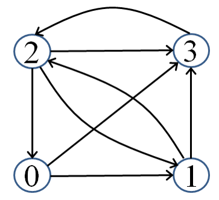

**王欢** **学号：220181499**
**github:** https://github.com/njustwh2014/data_structure_example

# 非线性结构--图和排序
#### 对于有n个顶点的有向图G，设计算法，找出G中长度为k（k<=n）的路径条数。

例如：上图中1到2长度为2的路径有1（132）条，长度为3的路有2条（1212,1232）。2到3的长度为2的路径有2条（203，213），长度为3的路径有3条（2013，2123，2323）


#### 试编写程序，实现最小生成树的克鲁斯卡尔算法。
```python
# 用Kruskal算法实现最小生成树
#建立并查集 搜索Find 合并连通域Union
import numpy as np
class MST():
    def __init__(self,edges=np.array([]),n=0,m=0):
        self.edges=edges;#无向图边的信息 格式：u v w u和v是顶点编号，从1开始，w是边的权重。
        self.n=n;#无向图的顶点数
        self.m=m;#无向图的边数
        self.parent=[-1]*(n+1);#建立每个顶点所在连通域的根节点
        self.edges=self.edges[np.lexsort(self.edges.T)];
        self.mst=np.array([]);
    def __find__(self,x):
        s=x;
        while(s>=0 and self.parent[s]>=0):
            s=self.parent[s];
        while(s!=x):#压缩搜索路径
            temp=self.parent[x];
            self.parent[x]=s;
            x=temp;
        return s;

    def __union__(self,N1,N2):#合并两个节点所在的连通域
        r1=self.__find__(N1);
        r2=self.__find__(N2);
        temp=self.parent[r1]+self.parent[r2];
        if(self.parent[r1]>self.parent[r2]):
            self.parent[r2]=r1;
            self.parent[r1]=temp;
        else:
            self.parent[r1]=r2;
            self.parent[r2]=temp;

    def kruskal(self):
        sumweight=0;
        num=0;
        for item in self.edges:
            if(self.__find__(item[0])!=self.__find__(item[1])):
                sumweight=sumweight+item[2];
                num=num+1;
                if(num==1):
                    self.mst=np.array([item]);
                else:
                    self.__union__(item[0], item[1]);
                    item_x=np.array(item);
                    self.mst=np.insert(self.mst,0,values=item_x,axis=0);
            if(num>self.n-1):
                break
        return self.mst,sumweight;
```

#### 试设计算法，找出给定DAG（有向无环图）中所有可能的拓扑序列。
```python
```

#### 编写算法，实现图的m着色（可参照韦尔奇.鲍威尔(Welch Powell) 方法）

#### 按照快速排序的思想，编写实现链表排序的算法。
```python
class Node():
    def __init__(self,data=0,next=0):
        self.data=data;
        self.next=next;
class LinkList():
    def __init__(self):
        self.head=0;
        self.length=0;
    def is_empty(self):
        if(self.head==0):
            return True;
        else:
            return False;

    def get_item(self,data):
        if(self.is_empty()==True):
            print("The LinkList is empty!");
            return -1;
        else:
            j=0;
            p=self.head;
            while(p.next!=0):
                if(data==p.data):
                    return j;
                else:
                    p=p.next;
                    j=j+1;
            if (data == p.data):
                return j;
            print("Objects that do not exist in the linked list!");
            return -1;

    def append(self,data):
        if(self.is_empty()==True):
            newNode=Node(data);
            self.head=newNode;
            self.length=self.length+1;
        else:
            newNode=Node(data);
            p=self.head;
            while(p.next!=0):
                p=p.next;
            p.next=newNode;
            self.length=self.length+1;

    def insert(self,data,index):
        if(index<0 and index>self.length):
            print("the index is wrong!");
            return False;
        j=0;
        p=self.head;
        while(j<index):
            p=p.next;
            j=j+1;
        newNode=Node(data);
        pnext=p.next;
        p.next=newNode;
        newNode.next=pnext;
        self.length=self.length+1;
        return True;

    def get_length(self):
        return self.length;

    def delete(self,data):
        if(self.get_item(data)==-1):
            print("Objects that do not exist in the linked list!");
            return False;
        p=self.head;
        pfront=0;
        if(self.head.data==data):
            self.head=0;
            self.length=0;
            return True;
        pfront=p;
        p=p.next;
        while(p.next!=0):
            if(p.data==data):
                pfront.next=p.next;
                self.length=self.length-1;
                return True;
            else:
                pfront=p;
                p=p.next;
        if(p.data==data):
            pfront.next = p.next;
            self.length = self.length - 1;
            return True;
        return False;
    def printAll(self):
        if(self.length==0):
            print("the linklist is empty!");
            return ;
        p=self.head;
        print("there are {} nodes:".format(self.length));
        while(p.next!=0):
            print(p.data,end=" ");
            p=p.next;
        print(p.data);
        return ;

    def __quick_sort_location__(self,phead,pend):
        if (phead == pend or phead.next == pend):
            return phead;
        key=phead.data;
        pprev=phead;
        plast=phead;
        while(plast!=pend):
            if(plast.data<key):
                pprev=pprev.next;
                temp=pprev.data;
                pprev.data=plast.data;
                plast.data=temp;
            plast=plast.next;
        if (plast.data < key):
            pprev = pprev.next;
            temp = pprev.data;
            pprev.data = plast.data;
            plast.data = temp;
        phead.data=pprev.data;
        pprev.data=key;
        return pprev;


    def __quick_sort__(self,phead,pend): #作业四：5.按照快速排序的思想，编写实现链表排序的算法。
        if(phead==pend or phead.next==pend):
            return ;
        mid=self.__quick_sort_location__(phead,pend);
        self.__quick_sort__(phead,mid);
        self.__quick_sort__(mid.next,pend);

    def quick_sort(self):
        if(self.head==0 or self.head.next==0):
            return;
        p=self.head;
        while(p.next!=0):
            p=p.next;
        self.__quick_sort__(self.head,p);
```

#### 按照归并排序的思想，编写实现链表排序的算法。
```python
class Node():
    def __init__(self,data=0,next=0):
        self.data=data;
        self.next=next;
class LinkList():
    def __init__(self):
        self.head=0;
        self.length=0;
    def is_empty(self):
        if(self.head==0):
            return True;
        else:
            return False;

    def get_item(self,data):
        if(self.is_empty()==True):
            print("The LinkList is empty!");
            return -1;
        else:
            j=0;
            p=self.head;
            while(p.next!=0):
                if(data==p.data):
                    return j;
                else:
                    p=p.next;
                    j=j+1;
            if (data == p.data):
                return j;
            print("Objects that do not exist in the linked list!");
            return -1;

    def append(self,data):
        if(self.is_empty()==True):
            newNode=Node(data);
            self.head=newNode;
            self.length=self.length+1;
        else:
            newNode=Node(data);
            p=self.head;
            while(p.next!=0):
                p=p.next;
            p.next=newNode;
            self.length=self.length+1;

    def insert(self,data,index):
        if(index<0 and index>self.length):
            print("the index is wrong!");
            return False;
        j=0;
        p=self.head;
        while(j<index):
            p=p.next;
            j=j+1;
        newNode=Node(data);
        pnext=p.next;
        p.next=newNode;
        newNode.next=pnext;
        self.length=self.length+1;
        return True;

    def get_length(self):
        return self.length;

    def delete(self,data):
        if(self.get_item(data)==-1):
            print("Objects that do not exist in the linked list!");
            return False;
        p=self.head;
        pfront=0;
        if(self.head.data==data):
            self.head=0;
            self.length=0;
            return True;
        pfront=p;
        p=p.next;
        while(p.next!=0):
            if(p.data==data):
                pfront.next=p.next;
                self.length=self.length-1;
                return True;
            else:
                pfront=p;
                p=p.next;
        if(p.data==data):
            pfront.next = p.next;
            self.length = self.length - 1;
            return True;
        return False;
    def printAll(self):
        if(self.length==0):
            print("the linklist is empty!");
            return ;
        p=self.head;
        print("there are {} nodes:".format(self.length));
        while(p.next!=0):
            print(p.data,end=" ");
            p=p.next;
        print(p.data);
        return ;

    def __merge_sort__(self,phead):#作业四：6.按照归并排序的思想，编写实现链表排序的算法。
        # 先判断链表长度是否大于1，小于1时无须排序
        if (phead != 0 and phead.next != 0):

            pfast=phead.next;
            pslow=phead;
            # 利用快慢指针找到链表的中间节点
            while(pfast!=0 and pfast.next!=0):
                pfast=pfast.next.next;
                pslow=pslow.next;

            # 递归实现归并排序

            phead1=self.__merge_sort__(pslow.next);

            pslow.next=0; #这个很重要
            phead2=self.__merge_sort__(phead);

            # 对子表进行合并
            vphead=Node();
            cur=vphead;#建立个伪头节点;
            while(phead1!=0 and phead2!=0):
                if(phead1.data<phead2.data):
                    cur.next=phead1;
                    phead1=phead1.next;
                else:
                    cur.next=phead2;
                    phead2=phead2.next;
                cur=cur.next;
            if(phead1!=0):
                cur.next=phead1;
            if(phead2!=0):
                cur.next=phead2;
            return vphead.next;

        return phead;
    def merge_sort(self):
        if(self.length<2):
            return ;
        self.head=self.__merge_sort__(self.head);
```
