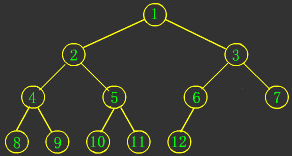
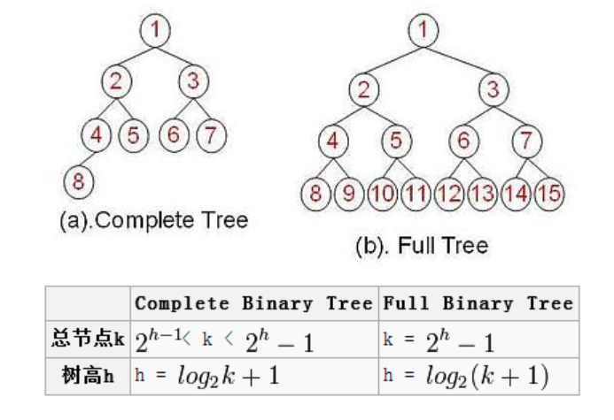
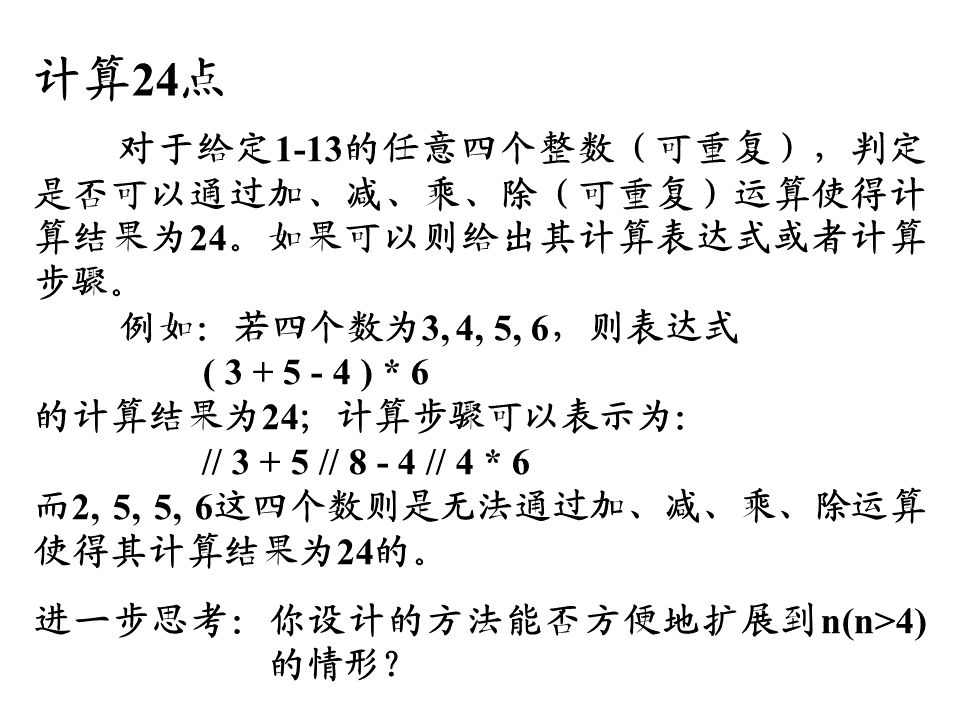

# 链表重排问题
## [linklisttest.py](linklisttest.py)
给定一个单链表 L：L0→L1→…→Ln-1→Ln ，
将其重新排列后变为： L0→Ln→L1→Ln-1→L2→Ln-2→…

你不能只是单纯的改变节点内部的值，而是需要实际的进行节点交换。

示例 1:

给定链表 1->2->3->4, 重新排列为 1->4->2->3.
示例 2:

给定链表 1->2->3->4->5, 重新排列为 1->5->2->4->3.

# Stack操作
## [StackTest.py](StackTest.py)

* 试设计算法，将栈S中的元素排序。要求不用辅助数据结构，仅通过对S自身的操作完成S中元素的排序。PS:我还是利用了两个栈，不符合题意。

* 现有栈S，试设计算法，将S中的元素逆置。要求不用辅助数据结构，仅通过对S自身的操作完成S中元素的逆置。

# 树、二叉树、满二叉树、完全二叉树

## 自由树
自由树是一个连通的、无回路的无向图。下面表述是等价的。

* G是自由树
* G中任意两个顶点由唯一一条简单路径得到。
* G是连通的，但从E中去掉任何边后得到的图都是非连通的。
* G是无回路的，且|E|=|V|-1。
* G是连通的，且|E|=|V|-1。
* G是无回路的，但添加任何边到E中得到的图包含回路。

## 二叉树
在计算机科学中，**二叉树**是每个节点最多有两个子树的树结构。通常子树被称作“左子树”（left subtree）和“右子树”（right subtree）。二叉树的每个结点至多只有二棵子树(不存在度大于2的结点)，二叉树的子树有左右之分，次序不能颠倒。

二叉树的第i层至多有$2^{(i-1)}$个结点；

深度为k的二叉树至多有$2^k-1$个结点；（等比数列$1+2+4+\cdots+2^{(k-1)} = 2^k-1$）。

对任何一棵二叉树T，如果其终端结点数为$n_0$，度为2的结点数为$n_2$，则$n_0 = n_2 + 1$。

树和二叉树的三个主要差别：

1)  树的结点个数至少为1，而二叉树的结点个数可以为0；

2)  树中结点的最大度数没有限制，而二叉树结点的最大度数为2；

3)  树的结点无左、右之分，而二叉树的结点有左、右之分。

## 完全二叉树

* 完全二叉树是由满二叉树而引出来的。对于深度为K的，有n个结点的二叉树，当且仅当其每一个结点都与深度为K的满二叉树中编号从1至n的结点一一对应时称之为完全二叉树。

* 若设二叉树的深度为h，除第h层外，其它各层(1～h-1)的结点数都达到最大个数，第h层所有的结点都连续集中在最左边，这就是完全二叉树。

满二叉树一定是完全二叉树，完全二叉树不一定是满二叉树。

下面是完全二叉树的基本形态：

完全二叉树的性质：

1) 深度为k的完全二叉树，至少有$2^{(k-1)}$个节点，至多有$2^k-1$个节点。

2) 树高$h=log2n + 1$。

## 满二叉树
一棵深度为k，且有$2^k-1$个节点的树是满二叉树。

另一种定义：除了叶结点外每一个结点都有左右子叶且叶子结点都处在最底层的二叉树。

这两种定义是等价的。

从树的外形来看，满二叉树是严格三角形的，大家记住下面的图，它就是满二叉树的标准形态：

所有内部节点都有两个子节点，最底一层是叶子节点。

**性质：**

1) 如果一颗树深度为h，最大层数为k，且深度与最大层数相同，即k=h;

2) 它的叶子数是:$2^{(h-1)}$

3) 第k层的结点数是:$2^{(k-1)}$

4) 总结点数是:$2^k-1$ 

5) 总节点数一定是奇数。

6) 树高:$h=log2(n+1)$。

## 完全二叉树与满二叉树树高计算

# 骑士周游问题
## [Knight_traveled_around.py](Knight_traveled_around.py)
## [Knight_dst.py](knight_dst.py) 解决思考题

# 八数码问题
## [eightnumques.py](eightnumques.py)

# 统计黑格子问题
## [countblack.py](count_black.py)

# 计算24点问题
## [howequal24.py](howequal24.py)

